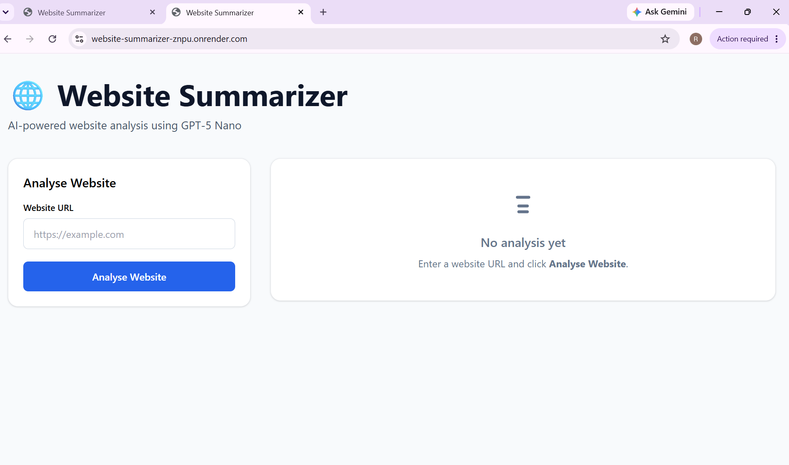
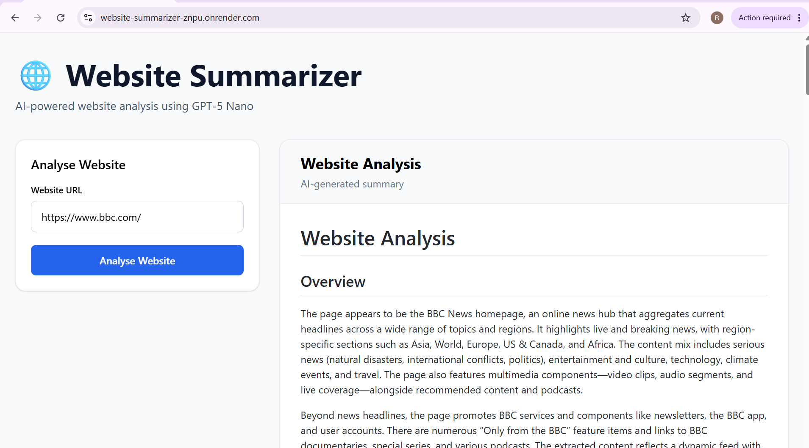

# 🌐 Website Summarizer

An AI-powered website summarizer built with **FastAPI**, **HTMX**, **Jinja2**, **BeautifulSoup**, and the **OpenAI API**. Enter any publicly accessible website URL to receive a structured, easy-to-read summary generated using GPT.

---

## ✨ Features

* 🌍 Summarize any publicly accessible website
* 🤖 AI-generated structured website analysis
* 📝 GitHub-flavored Markdown rendering
* ⚡ Fast, responsive UI powered by HTMX
* 🎨 Modern interface built with Tailwind CSS
* 🔍 Intelligent content extraction using BeautifulSoup
* 🛡️ Environment-based configuration with Pydantic Settings
* 🧩 Layered architecture with dependency injection
* 🚀 Fully asynchronous FastAPI backend
* ✅ Comprehensive unit and integration test suite

---

## 🚀 Live Demo

🌍 **Website:** https://website-summarizer-znpu.onrender.com

Try summarizing any publicly accessible website directly in your browser.

---

## 📸 Screenshots

### Home Page



### Generated Summary



---

## 🏗️ Architecture

```text
Browser
    │
    ▼
FastAPI Route
    │
    ▼
WebsiteSummarizer
    ├───────────────┐
    ▼               ▼
WebsiteFetcher   OpenAIService
    │               │
    ▼               ▼
BeautifulSoup    OpenAI API
    │
    ▼
Markdown Renderer
    │
    ▼
HTML Response
```

The application uses **FastAPI's dependency injection** to compose the `WebsiteSummarizer` service from `WebsiteFetcher` and `OpenAIService`. This keeps business logic separated from HTTP handling and makes the application easier to test and maintain.

---

## 🛠️ Tech Stack

### Backend

* FastAPI
* Uvicorn
* httpx
* BeautifulSoup4
* OpenAI Python SDK
* Pydantic Settings

### Frontend

* Jinja2
* HTMX
* Tailwind CSS
* GitHub Markdown CSS

### Development

* Python 3.12+
* uv
* Pytest
* pytest-asyncio
* respx
* Ruff

---

## 📂 Project Structure

```text
website-summarizer/
│
├── app/
│   ├── api/
│   ├── core/
│   ├── models/
│   ├── services/
│   ├── static/
│   ├── templates/
│   └── main.py
│
├── tests/
│   ├── unit/
│   └── integration/
│
├── docs/
├── README.md
├── pyproject.toml
├── uv.lock
└── .env.example
```

---

## 🚀 Getting Started

### 1. Clone the repository

```bash
git clone https://github.com/vr-krishna/website-summarizer.git
cd website-summarizer
```

### 2. Install dependencies

```bash
uv sync
```

### 3. Configure environment variables

Copy the example environment file:

```bash
cp .env.example .env
```

Update the values:

```env
OPENAI_API_KEY=your_openai_api_key
MODEL_NAME=gpt-5-nano
```

### 4. Start the application

```bash
uv run uvicorn app.main:app --reload
```

Open your browser:

```text
http://127.0.0.1:8000
```

---

## 💡 How It Works

1. Enter a website URL.
2. The application downloads the webpage.
3. BeautifulSoup extracts the readable content.
4. The cleaned content is sent to the OpenAI API.
5. The AI generates a structured Markdown summary.
6. Markdown is converted to HTML.
7. The summary is rendered in the browser.

---

## 📡 API

### `GET /`

Returns the home page.

### `POST /summarize`

Accepts a website URL as form data and returns the rendered HTML summary.

| Field | Type   | Description              |
| ----- | ------ | ------------------------ |
| `url` | string | Website URL to summarize |

---

## 📋 Example Summary

Generated summaries typically include:

* Website Overview
* Website Category
* Purpose
* Key Topics
* Important Information
* Products / Services
* News & Announcements
* Important Entities
* Target Audience
* Key Takeaways
* Overall Impression

---

## 🧪 Testing

Run all tests:

```bash
uv run pytest
```

Run tests with coverage:

```bash
uv run pytest --cov=app
```

The project includes:

* Unit tests for all service classes
* Integration tests for FastAPI routes
* Mocked OpenAI API interactions
* Mocked HTTP requests using `respx`

---

## 🔒 Environment Variables

| Variable         | Description                         |
| ---------------- | ----------------------------------- |
| `OPENAI_API_KEY` | OpenAI API key                      |
| `MODEL_NAME`     | OpenAI model used for summarization |

---

## 🌐 Deployment

The application can be deployed to platforms such as:

* Render
* Railway
* Fly.io
* Azure App Service

Configure environment variables through your hosting provider and **never commit secrets** to the repository.

---

## 🗺️ Roadmap

* [x] Async FastAPI backend
* [x] HTMX frontend
* [x] AI-powered website summaries
* [x] Markdown rendering
* [x] Responsive UI
* [x] Comprehensive unit and integration tests
* [ ] Improved URL validation & SSRF protection
* [ ] Download summaries as Markdown
* [ ] Copy summary to clipboard
* [ ] Docker support
* [ ] GitHub Actions CI/CD
* [ ] Summary caching
* [ ] Multiple analysis modes
* [ ] User authentication
* [ ] Summary history

---

## 🤝 Contributing

Contributions, suggestions, and improvements are welcome.

1. Fork the repository.
2. Create a feature branch.
3. Commit your changes.
4. Open a Pull Request.

---

## 📄 License

This project is licensed under the MIT License.

---

## 👨‍💻 Author

**Krishna V**

GitHub: https://github.com/vr-krishna
